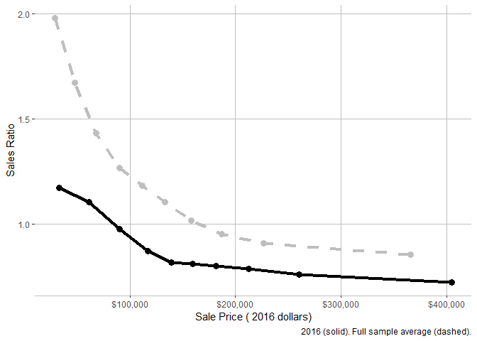
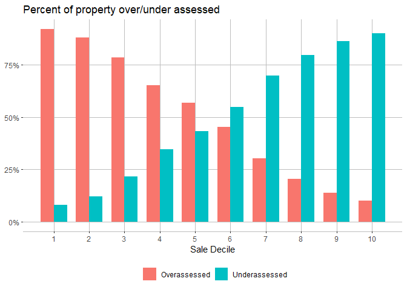
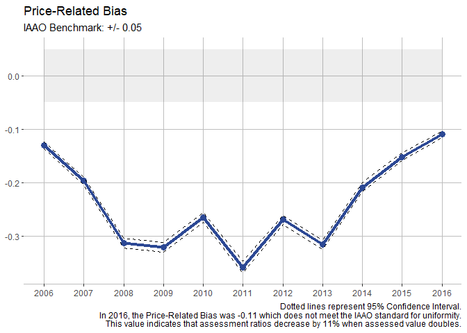
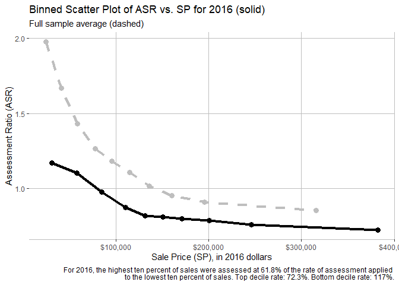

<!-- README.md is generated from README.Rmd. Please edit that file -->

# cmfproperty

This package analyzes property tax regressivity and produces various
tables and figures for a sales ratio study.

## Installation

You can install the development version from
[GitHub](https://github.com/) with:

``` r
# install.packages("devtools")
devtools::install_github("erhla/cmfproperty")
```

## Example

This is the basic framework to conduct a sales ratio study:

``` r
library(cmfproperty)
df <- cmfproperty::example_data
df <-
  cmfproperty::reformat_data(
    df,
    sale_col = "SALE_PRICE",
    assessment_col = "ASSESSED_VALUE",
    sale_year_col = "SALE_YEAR",
    filter_data = TRUE
  )
stats <- cmfproperty::calc_iaao_stats(df)
head(stats)
#>       N     COD  COD_SE    PRD PRD_SE     PRB PRB_SE  q1_ratio median_ratio
#> 1 11448 15.6920  5.9279 1.0277 0.0083 -0.0706 0.0026 0.7463933    0.8350732
#> 2 12341 16.3622  6.6752 1.0321 0.0070 -0.0737 0.0025 0.8122727    0.9000000
#> 3 14002 18.4400  7.5252 1.0847 0.0095 -0.0868 0.0027 0.7787830    0.8794514
#> 4 13449 19.1875  7.0249 1.0770 0.0090 -0.0887 0.0029 0.7556391    0.8543689
#> 5 13743 21.9013  7.3364 1.1015 0.0079 -0.1301 0.0032 0.8974978    1.0068293
#> 6 12634 26.9728 10.6388 1.1758 0.0177 -0.1967 0.0036 0.9369951    1.0879731
#>    q3_ratio q1_sale median_sale q3_sale q1_assessed_value median_assessed_value
#> 1 0.9407725   68900    108162.5  146525             55075                 87100
#> 2 1.0040000   71500    113000.0  153000             63500                 99600
#> 3 1.0219354   65000    107750.0  153000             57000                 91100
#> 4 1.0000000   70100    114900.0  160000             61000                 94600
#> 5 1.2715880   62500    105000.0  153000             66500                105200
#> 6 1.4789264   53000     95000.0  149500             67000                106000
#>   q3_assessed_value Year
#> 1            120700 2002
#> 2            136000 2003
#> 3            133400 2004
#> 4            136400 2005
#> 5            153000 2006
#> 6            153975 2007
```

More advanced features are available as well:

``` r
cmfproperty::regression_tests(df)
#>         Model         Value Test T Statistic  Conclusion
#> 1    paglin72  4.325107e+04  > 0   253.07047  Regressive
#> 2     cheng74  6.749357e-01  < 1   500.03105  Regressive
#> 3      IAAO78 -2.034027e-06  < 0  -195.83335  Regressive
#> 4    kochin82  8.491533e-01  < 1   500.03105  Regressive
#> 5      bell84  2.883853e+04  > 0   167.10674  Regressive
#> 6             -1.376471e-07  < 0  -194.35497  Regressive
#> 7 sunderman90 -3.927464e+04  > 0   -44.20409 Progressive
#> 8     clapp90  1.216439e+00  > 1   493.80804  Regressive
#>                             Model Description
#> 1                                     AV ~ SP
#> 2                             ln(AV) ~ ln(SP)
#> 3                                  RATIO ~ SP
#> 4                             ln(SP) ~ ln(AV)
#> 5                              AV ~ SP + SP^2
#> 6                              AV ~ SP + SP^2
#> 7 AV ~ SP + low + high + low * SP + high * SP
#> 8               ln(SP) ~ ln(AV) -> ln(AV) ~ Z
```

``` r
plot_ls <-
  cmfproperty::plots(stats,
                     df,
                     min_reporting_yr = 2006,
                     max_reporting_yr = 2016)
plot_ls[[1]]
```

<!-- -->

``` r
plot_ls[[2]]
```

<!-- -->

``` r
plot_ls[[3]]
```

<!-- -->

``` r
plot_ls[[4]]
```

<!-- -->
